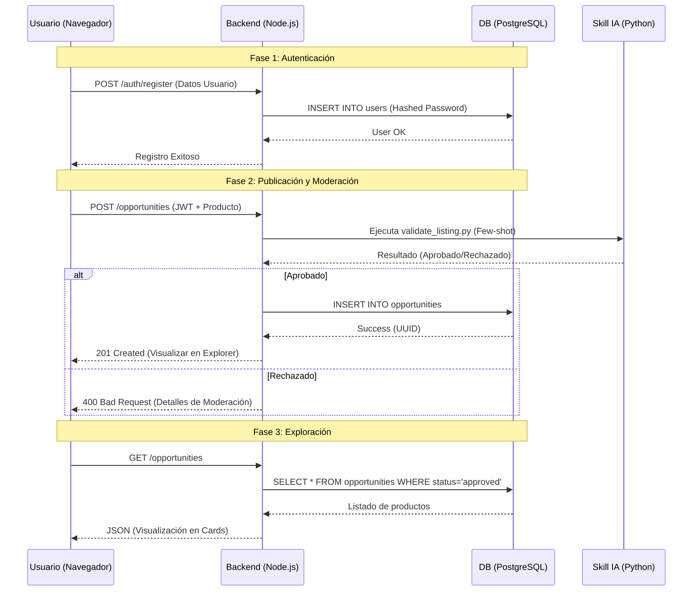

# Arquitectura de NEOLINK HUB

## Flujo de Datos General

El siguiente diagrama muestra cómo interactúan los componentes desde que un usuario se registra hasta que publica un producto moderado por IA.

## Componentes Clave

### 1. Sistema de Autenticación "Zero-Dep"
Para maximizar la portabilidad en entornos restringidos, implementamos un sistema de Auth nativo:
- **Hashing:** PBKDF2 (Password-Based Key Derivation Function 2).
- **Tokens:** JWT personalizado usando `crypto.createHmac`.

### 2. Moderación Inteligente
El motor de moderación en Python utiliza lógica de negocio avanzada y patrones de IA para validar:
- Longitud de descripción mínima (100 chars).
- Taxonomía de categorías permitidas.
- Detección de spam (clickbait, exceso de símbolos).
- Validación de precios B2B.

### 3. Frontend Glassmorphism
Interfaz moderna diseñada para una experiencia de usuario fluida sin frameworks pesados, utilizando CSS dinámico y Modales para la gestión de detalles.
